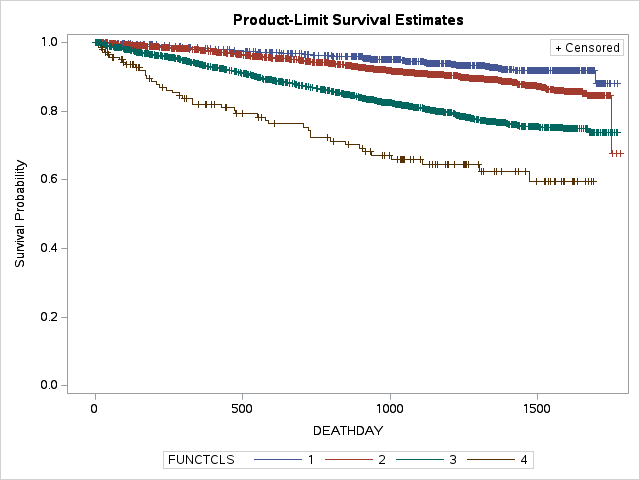

# dig-heart-severity-mortality-sas

#  Academic analysis of the DIG teaching dataset:Association Between Heart Failure Severity and Heart-Failure-Specific Mortality in the Digitalis Investigation Group Trial

## Overview

This project examines the association between baseline heart failure severity and heart-failure-specific mortality using the Digitalis Investigation Group (DIG) teaching dataset.

The primary exposure was New York Heart Association (NYHA) functional class, a clinical measure of functional limitation associated with heart failure. The primary outcome was heart-failure-specific mortality, defined as death for which worsening heart failure was recorded as the primary cause of death.

Time-to-event analysis was conducted using follow-up time from randomization to the occurrence of heart-failure-specific death or censoring.

This was an individual academic project applying epidemiologic and biostatistical methods to a clinical trial dataset.

## Research Question

Is baseline heart failure severity, measured by NYHA functional class, associated with heart-failure-specific mortality among participants in the DIG trial?

A secondary objective was to assess whether the association between NYHA functional class and heart-failure-specific mortality differed by sex.

## Data

The analysis used the Digitalis Investigation Group (DIG) teaching dataset made available through the NHLBI Biologic Specimen and Data Repository Information Coordinating Center (BioLINCC).

The primary exposure was NYHA functional class:

Class I: No limitation on physical activity
Class II: Slight limitation of physical activity
Class III: Marked limitation of physical activity
Class IV: Inability to carry on physical activity without discomfort
Primary Outcome
The primary outcome was heart-failure-specific mortality, defined as death due to worsening heart failure as the recorded primary cause of death.

Cause of death was categorized as:

Worsening heart failure
Other cardiac
Other vascular
Unknown
Other non-cardiac
For the primary analysis, deaths attributed to worsening heart failure were classified as events. Participants who did not experience heart-failure-specific death were censored at their observed follow-up time, including participants who died from other causes.

Potential Confounders
The adjusted analysis included:

Age
Sex
Race
Diabetes
Hypertension
Body mass index (BMI)
Chronic heart failure duration


## Statistical Methods

Descriptive statistics were used to summarize participant characteristics.

Survival analysis was conducted using:

Kaplan-Meier survival estimates stratified by NYHA functional class
Cox proportional hazards regression
Effect modification analysis using an interaction between NYHA functional class and sex
Adjusted Cox Proportional Hazards Model
The primary Cox proportional hazards model estimated the association between baseline NYHA functional class and heart-failure-specific mortality, adjusting for:

Sex
Age
Race
Hypertension
Diabetes
BMI
Chronic heart failure duration
NYHA Class I was specified as the reference category.

Effect Modification by Sex
A second adjusted Cox proportional hazards model included an interaction term between NYHA functional class and sex to assess whether the association between heart failure severity and heart-failure-specific mortality differed by sex.

Both individual interaction terms and the overall NYHA × sex interaction were evaluated.

Analyses were conducted using SAS.


## Results

### Baseline Characteristics

The study included 6,800 participants, including 1,519 women (22%) and 5,281 men (78%). Women and men differed significantly in ejection fraction, race, NYHA functional class, and chronic heart failure etiology. Other evaluated characteristics, including age, BMI, diabetes, hypertension, and previous myocardial infarction, did not differ significantly by sex.

### Adjusted Cox Proportional Hazards Model

Baseline Characteristics
The study included 6,800 participants, including 1,519 women (22%) and 5,281 men (78%).

Women and men differed significantly in ejection fraction, race, NYHA functional class, and chronic heart failure etiology. Other evaluated characteristics, including age, BMI, diabetes, hypertension, and previous myocardial infarction, did not differ significantly by sex.

Adjusted Cox Proportional Hazards Model
Baseline NYHA functional class was strongly associated with heart-failure-specific mortality after adjustment for sex, age, race, hypertension, diabetes, BMI, and chronic heart failure duration.

Compared with participants with NYHA Class I:

NYHA Class II: adjusted HR = 1.61 (95% CI: 1.22–2.12, p = 0.0008)
NYHA Class III: adjusted HR = 3.51 (95% CI: 2.66–4.64, p < 0.0001)
NYHA Class IV: adjusted HR = 7.17 (95% CI: 4.81–10.68, p < 0.0001)
These findings demonstrate a strong gradient in heart-failure-specific mortality, with progressively higher hazards observed among participants with more severe NYHA functional class.

Sex was not statistically significant in the adjusted model (HR = 0.85, 95% CI: 0.72–1.01, p = 0.0589).

Race, hypertension, diabetes, age, BMI, and chronic heart failure duration were also not statistically significant predictors of heart-failure-specific mortality after adjustment.

## Results

### Table 1. Baseline Characteristics
Table 1. Baseline Characteristics of DIG Trial Participants by Sex
Characteristic
Female (n = 1,519)
Male (n = 5,281)
p-value
Continuous Variables


Age, years
63.84 ± 10.91
63.38 ± 10.92
0.14
Ejection Fraction (%)
30.14 ± 8.91
28.08 ± 8.78
<0.001
BMI (kg/m²)
27.19 ± 5.18
27.09 ± 5.20
0.53
Serum Creatinine (mg/dL)
1.28 ± 0.36
1.29 ± 0.37
0.69
Duration of CHF (months)
30.86 ± 37.97
29.96 ± 36.56
0.40
Heart Failure Symptom Score (NSYM)
3.69 ± 0.75
3.65 ± 0.81
0.06
Categorical Variables


Race


<0.001
White
1,232 (81.1%)
4,577 (86.7%)


Non-White
287 (18.9%)
704 (13.3%)


NYHA Functional Class


<0.001
Class I
131 (8.6%)
776 (14.7%)


Class II
770 (50.7%)
2,894 (54.9%)


Class III
579 (38.1%)
1,502 (28.5%)


Class IV
38 (2.5%)
104 (2.0%)


Diabetes


0.84
No
1,084 (71.4%)
3,783 (71.6%)


Yes
435 (28.6%)
1,498 (28.4%)


Hypertension


0.60
No
821 (54.1%)
2,894 (54.8%)


Yes
698 (46.0%)
2,386 (45.2%)


Previous Myocardial Infarction


0.44
No
544 (35.8%)
1,836 (34.8%)


Yes
974 (64.2%)
3,445 (65.2%)


CHF Etiology


<0.001
Ischemic
938 (62.0%)
3,865 (73.4%)


Hypertensive
197 (13.0%)
386 (7.3%)


Valvular
29 (1.9%)
70 (1.3%)


Idiopathic
304 (20.1%)
703 (13.3%)


Alcohol-related
18 (1.2%)
204 (3.9%)


Other
28 (1.9%)
40 (0.8%)


### Table 2. Adjusted Cox Proportional Hazards Model
[Table 2]

### Table 3. Sex-Specific Associations
[Table 3]

### Table 4. Interaction Test
[Table 4]

### Figure 1. Kaplan-Meier Survival Curves
[Figure 1]

### Effect Modification by Sex

The association between NYHA functional class and heart-failure-specific mortality was evaluated separately by sex.

Compared with NYHA Class I, the adjusted hazard ratios were:

NYHA Class	Female Adjusted HR (95% CI)	Male Adjusted HR (95% CI)
Class I	Reference	Reference
Class II	2.13 (0.93–4.90)	1.53 (1.14–2.06)
Class III	4.24 (1.86–9.71)	3.45 (2.56–4.63)
Class IV	8.55 (3.09–23.26)	7.04 (4.55–10.99)

Although the point estimates differed between women and men, the individual interaction tests were not statistically significant:

NYHA II × sex: p = 0.466
NYHA III × sex: p = 0.644
NYHA IV × sex: p = 0.740
The overall NYHA functional class × sex interaction was also evaluated using a joint test of the three interaction parameters.

Interpretation: The analysis did not provide statistically significant evidence that sex modified the association between NYHA functional class and heart-failure-specific mortality.

### Kaplan-Meier Survival Analysis

Kaplan-Meier survival estimates were used to visualize time-to-event differences across NYHA functional classes.

Survival curves demonstrated progressively lower survival probabilities with increasing NYHA functional class. Participants with NYHA Class I had the highest observed survival probability, while participants with Classes III and IV demonstrated lower survival probabilities over follow-up.

## Kaplan-Meier Survival Analysis

Kaplan-Meier survival estimates were used to visualize differences in time to heart-failure-specific mortality across NYHA functional classes.



*Figure 1. Kaplan-Meier survival curves for heart-failure-specific mortality by baseline NYHA functional class.*


## Discussion

This analysis demonstrated a strong association between greater baseline heart failure severity and heart-failure-specific mortality in the DIG trial population.

Compared with NYHA Class I, the adjusted hazard of heart-failure-specific mortality was approximately 1.6-fold higher among participants with Class II disease, 3.5-fold higher among those with Class III disease, and 7.2-fold higher among those with Class IV disease. The progressive increase in hazard across NYHA classes supports a strong severity gradient between functional limitation and risk of heart-failure-specific death.

The association was also examined separately by sex. Although the estimated hazard ratios were somewhat higher among women for each NYHA comparison, the interaction between NYHA functional class and sex was not statistically significant. Therefore, this analysis did not provide evidence that the relationship between heart failure severity and heart-failure-specific mortality differed by sex.

A key limitation is the relatively small proportion of women in the study population (22%), which may have limited statistical power to detect sex-specific differences. The underrepresentation of women also limits the generalizability of these findings to contemporary and more diverse populations of patients with heart failure.

Another consideration is the use of a cause-specific mortality endpoint. Deaths from causes other than worsening heart failure were treated as censoring events in the cause-specific Cox analysis. Therefore, the estimated hazard ratios describe the association between NYHA class and the cause-specific hazard of heart-failure death, rather than the cumulative probability of experiencing heart-failure-specific death in the presence of competing causes of death.

## Conclusion

Higher baseline NYHA functional class was strongly associated with progressively higher hazard of heart-failure-specific mortality in the DIG trial population.

Compared with NYHA Class I, participants with Class II, III, and IV heart failure had substantially higher adjusted hazards of heart-failure-specific death.

Although sex-specific estimates suggested somewhat higher hazards among women, there was no statistically significant evidence of effect modification by sex.

These findings demonstrate the application of survival analysis, multivariable Cox regression, confounding adjustment, and interaction analysis to a clinical trial dataset.

## Software

- SAS
- PROC PHREG
- PROC LIFETEST
- PROC MEANS
- PROC TTEST
- PROC FREQ

## Skills Demonstrated

- SAS programming and data management
- Clinical trial data analysis
- Epidemiologic study design
- Descriptive statistics
- Survival analysis
- Kaplan-Meier estimation
- Cox proportional hazards regression
- Confounding adjustment
- Effect modification and interaction analysis
- Statistical interpretation
- Data visualization
- Scientific communication

## Project Objectives

This project applied epidemiologic and biostatistical methods to:

- Evaluate an epidemiologic research question using clinical trial data
- Apply survival analysis and Cox proportional hazards regression
- Assess potential confounding
- Evaluate effect modification using an interaction term
- Interpret statistical findings in the context of public health research
- Communicate findings through written and oral presentation

## Author

Jaimie Figueroa

## Repository Contents

```text
dig-heart-severity-mortality-sas/
│
├── README.md
│
├── sas/
│   └── analysis.sas
│
└── figures/
    └── kaplan_meier.png
